# Rotate 180, rotate 90 clockwisem rotate 90 Counter Clockwise, Flip Horizontal, Flip Vertical, Auto-Align Layers & Auto-Blend

---

## Rotate

- memutar sebuah object

1. Buka file
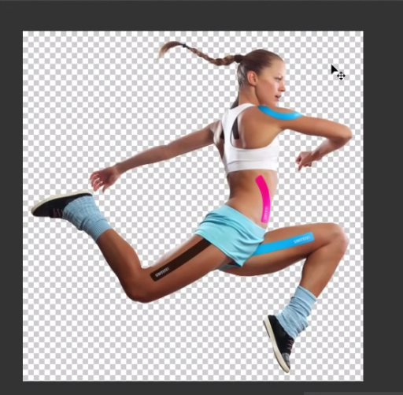

2. Buat layer baru
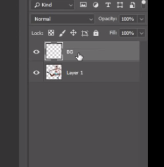

3. Beri warna layer baru

4. Ubah posisi layer
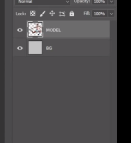

5. Edit > Transform > Rotate 180%
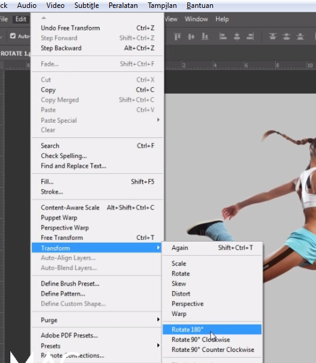

- untuk rotate 90 Clockwise : searah jarum jam
- untuk rotate 90 Counter Clockwise : berlawanan jarum jam

---

## Secara Manual

1 .ctrl + T
2. Isikan nilainya disini
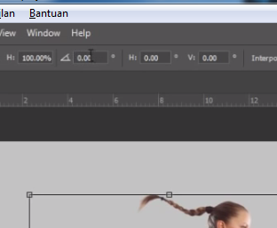

---

## Flip Horizontal & Flip Vertical

1. Siapkan gambar
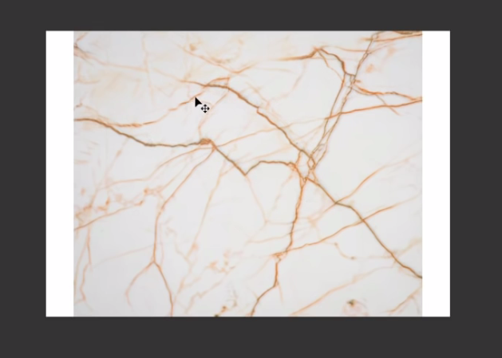

2. Rasterize Layer
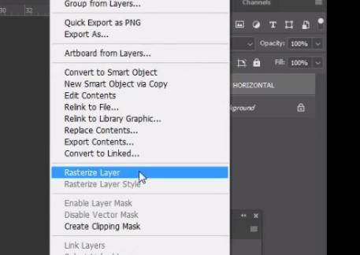

3. Copy sebagian gambar dengan Marquee

4. Tekan ctrl + J untuk copy layer yang diseleksi, digunakan untuk menutupi area gambar
5. Edit > Transform > Flip Horizontal
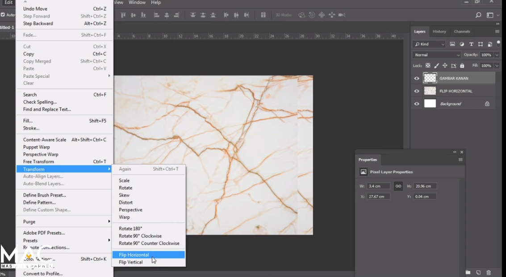

6. Ctrl + E : untuk menggabungkan layers

---

## Auto-Align Layers

- Fungsi : Menmepatkan kedua gambar menyatu yang tidak pakai dibuang

1. Siapkan gambar
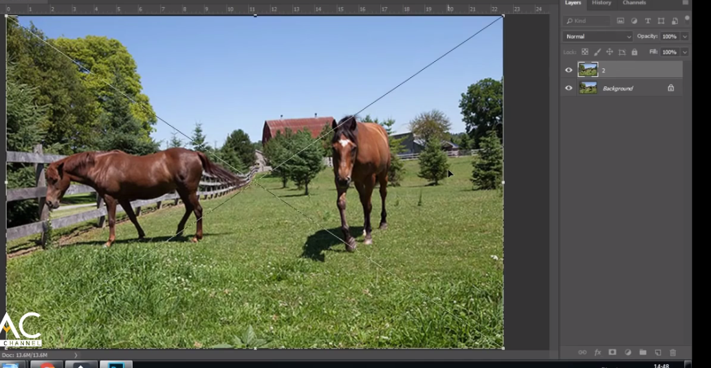

2. Tekan Shift layer > pilih 2 layer > Edit > Auto-Align Layers
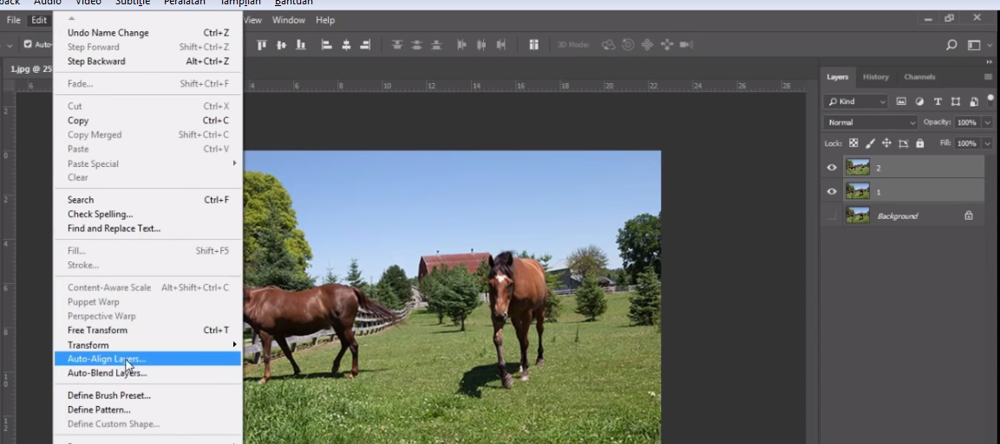

3. Pilih Auto
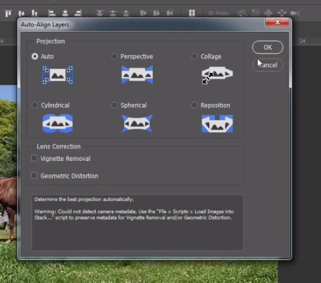

4. Tambahkan masking
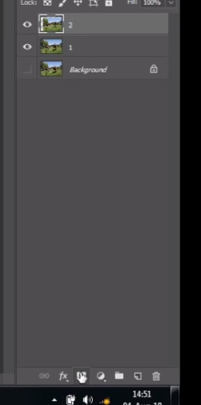

5. Pilih Brush
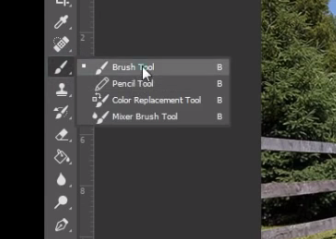

6. Hilangkan bagian yang diinginkan
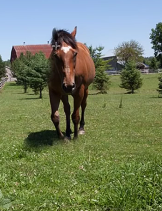

7. Pastikan harus hitam
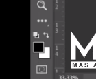

8. Mematikan masking : click + shift
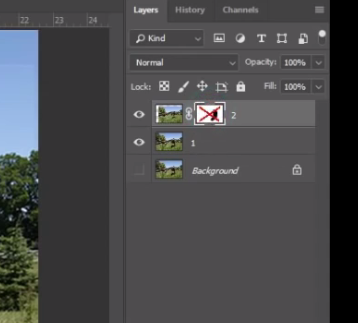

---

## Auto Blend

- Menggabungkan 2 gambar agar menyatu di frame

1. Siapkan 2 gambar dan 1 frame / layer
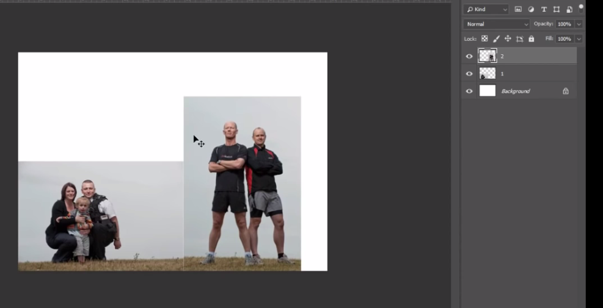

2. Perbesar gambar agar memenuhi layar, shift + click 2 layer gambar > ctrl + T
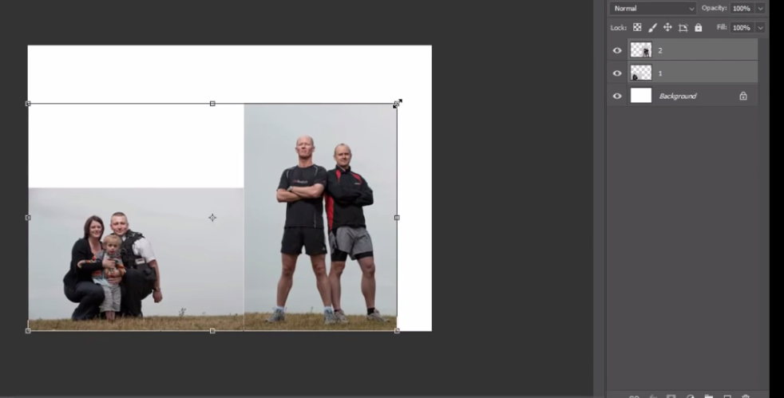

3. Click 2 layer > Edit > Auto-Blend Layers
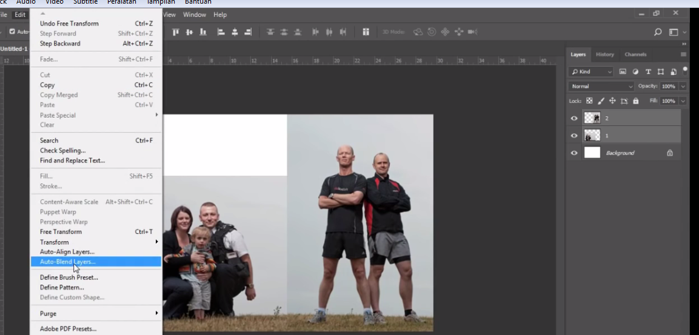

4. karena ingin menyatukan panorama bukan objectnya, jadi PIlih panorama
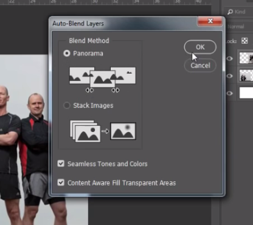
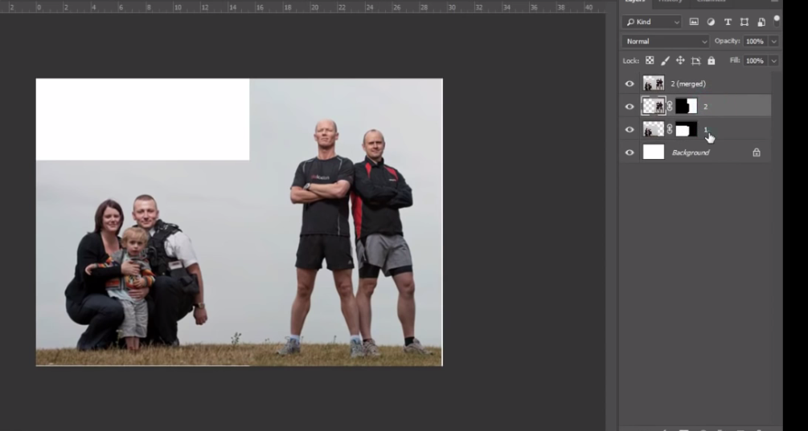
5. Tutup bagain putih dengan clone stamp
6. Hasil Akhir
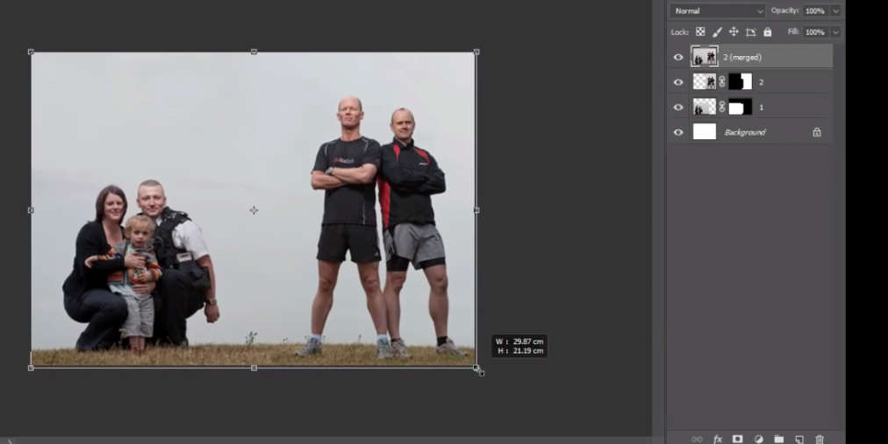