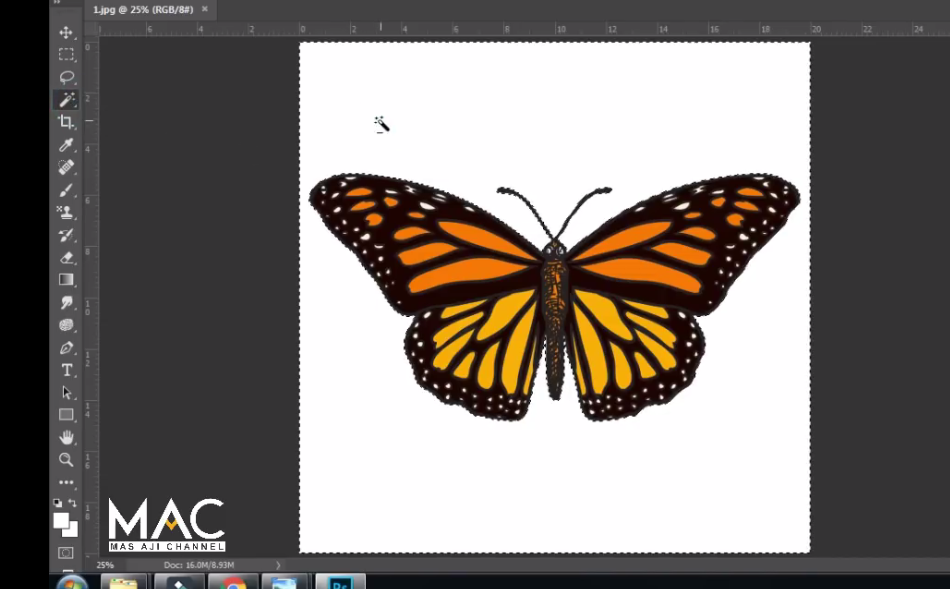

# Define Brush Preset, Define Pattern, Define Custom Shape

---

## Define Brush

- untuk membuat sebuah brush secara custom

1. Siapkan gambar

2. Seleksi gambar dengan magic wand tool

3. karena yang terseleksi background, balik seleksinya, Select > Inverse

4. Copy gambar, ctrl + j

5. Seleksi object, Rectangle tool

6. Edit > Define Brush Preset

7. atur nama > ok

---

## Menggunakan Brush

1. Buat layer baru

2. Brush >

3. Hasil :

---

## Brush untuk ttd

1. Buat layer baru 300px X 300px

2. Rubah warna jadi hitam

3. Pilih general brush

4. Buat ttd

5. gunakan ractangle marquee tool

6. Edit > Define Brush Present

---

## Define Pattern

- untuk membuat pattern sendiri

1. Buat document

2. Buat layer baru, tambahkan shape

3. Rasterize layers

4. Putar gambar, Filter > Other > Offset

5. Tambahkan shape baru

6. Jadikan pattern, seleksi dengan rectangle

7. Edit > Define Pattern...

---

## Cara menggunakan untuk background

1. Buat document baru

2. Buat layer untuk gradient

3. Buat layer lagi untuk patern, gunakan shape rectangle, hilangkan fill

4. Klik layer pattern > click fx > pattern Overlay

5. Hasil :

---

## Define Custome Shape

1. Siapkan gambar

2. Seleksi gambar dengan magic wand tool

3. Balik seleksi agar yang terseleksi objectnya
4. copy yang terseleksi, ctrl + j

5. Hilangkan bagian yang tidak diinginkan, dengan pen tool

6. Make selection

7. delate, hilangkan seleksi ctrl + d
8. jadikan kacamata untuk shape
9. seleksi object, ctrl + click layer

10. masuk ke path, Window > path

11. Pilih make work path

12. Edit > Define Custom Shape...

---

## Menggunakan

1. Buat document baru

2. Pilih shape > custom shape
