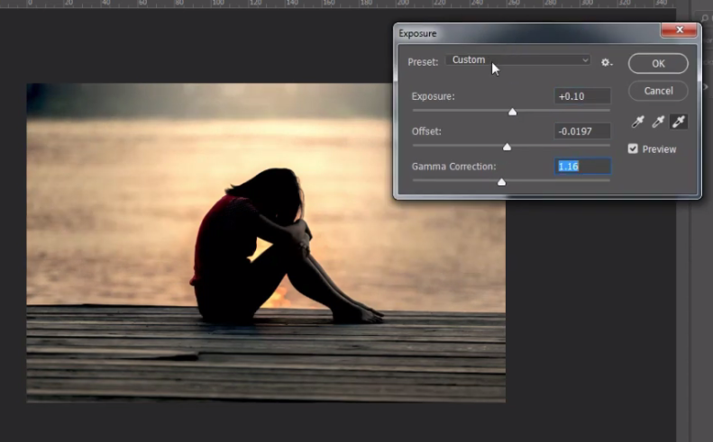
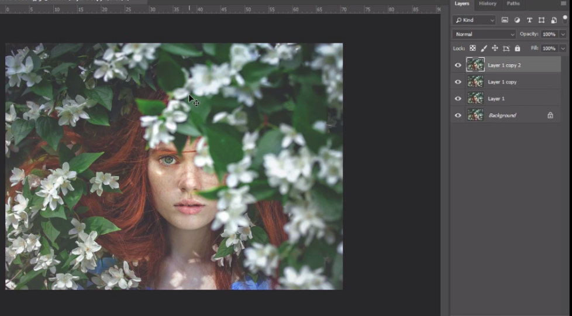

# Mode, Adjustment, Auto Tone, Auto Contrast, Auto Color

---

## Mode

- Ketika download file / gambar itu ada index, tidak bisa dicopy

- solusi : ubah dulu mode

1. Klik layer
2. Image > Mode > pilih RGB / CMYK

---

## Adjustment

- menu2 untuk mempercantik / mengelola warna pada gambar

---

## Brightness/Contrast

---

## Level

---

## Curves

---

## Exposure

---

## Vibrance

---

## Hue Saturation

---

## Color Balance

---

## Black and White

---

## Photo Filter

---

## Color Look Up

---

## Gradient Map

---

## Match Color

- Mengambil warna dari gambar lain

---

## Auto Tone, Auto Contrast, Auto Color

- copy gambar menjadi 3 layer

---

### Auto Tone

- membuat tone secara otomatis

---

### Auto Contrast

---

### Auto Color

---

## Menambahkan gradient
1. Edit > Presets > Preset Manager

2. Ubah present type : gradient, Load

3. Masukkan file gradient

4. Done
