# Spot Healing Brush Tool, Patch Tool, Brush Tool

---

## Spot Healing Brush Tool

### untuk menghilangkan watermark

1. Klik Spot Healing Brush Tool

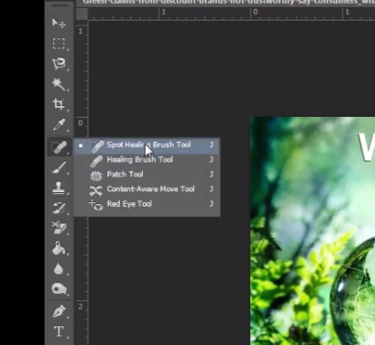

2 . Content-Aware

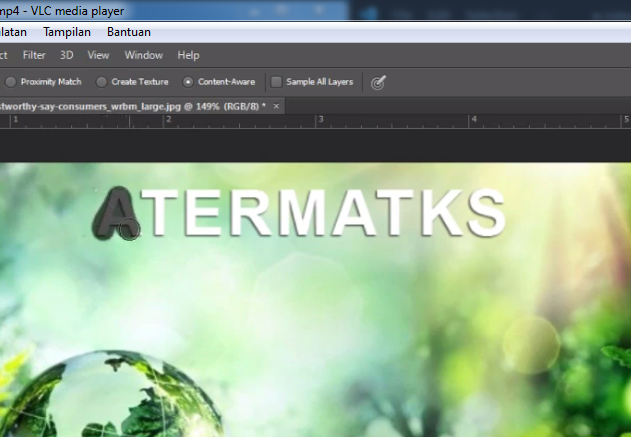

---

## Patch Tool

### untuk menghilangkan noda dalam bentuk seleksi dan harus ditarik menghilangkan jerawat

1. Klik Patch Tool

2. Lingkari yang ingin dihilangkan

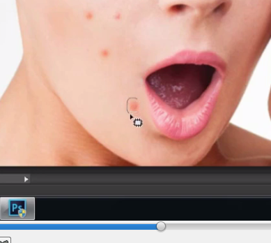

3. Klik dan tarik ke yang tidak ada jerawat

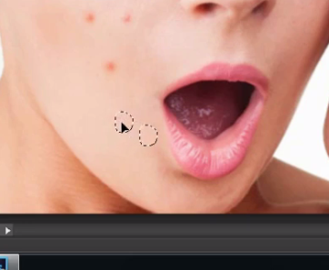

4. tekan ctrl + d = menghilangkan seleksi

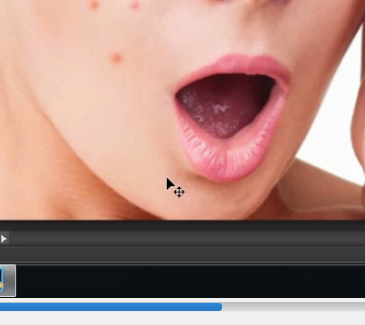

---

## Brush Tool

- membuat object dengan brush
- extensi = .abr

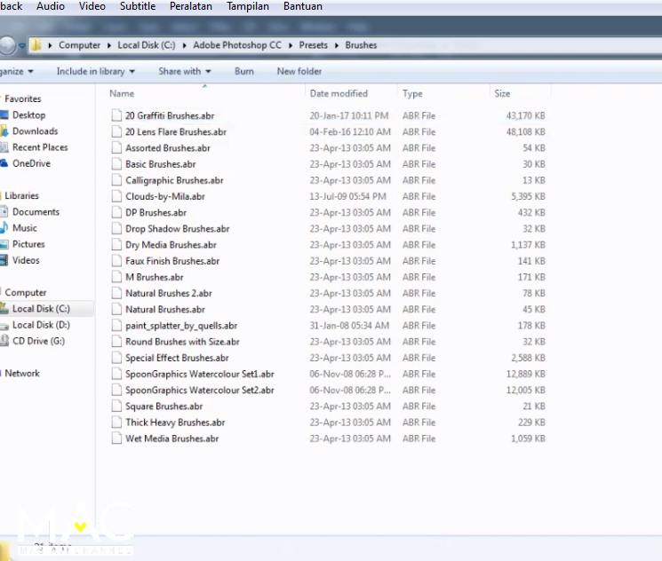

1. pilih brush

3. klik gambar ger > Load Brush

4. cari file brush
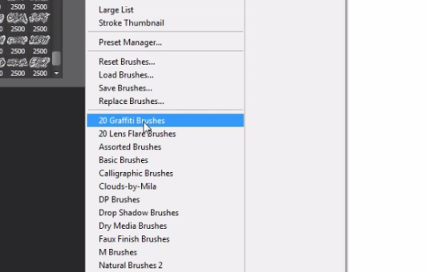

5. pilih nama brush
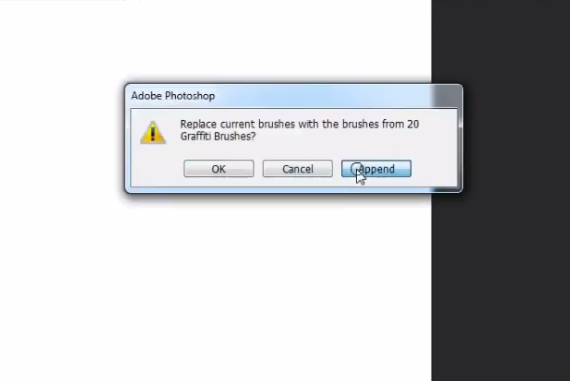

6. Klik append
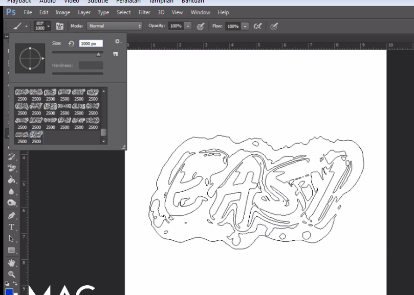

7. pilih brush > klik di kertas project
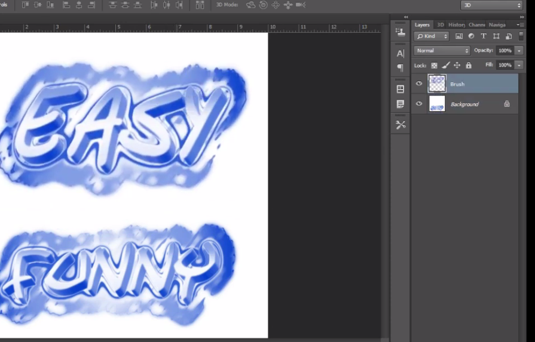

8. harus bikin layer baru agar bisa dipindah2, kalo tidak tidak bisa dipindah

---

## Clone Stamp Tool

- Mengcopy object disampingnya untuk menutupi object yang kita mau

1. Klik Clone Stamp Tool
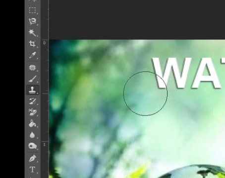

2. Buat layer baru
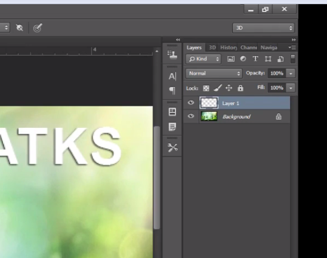

3. klik + tekan alt

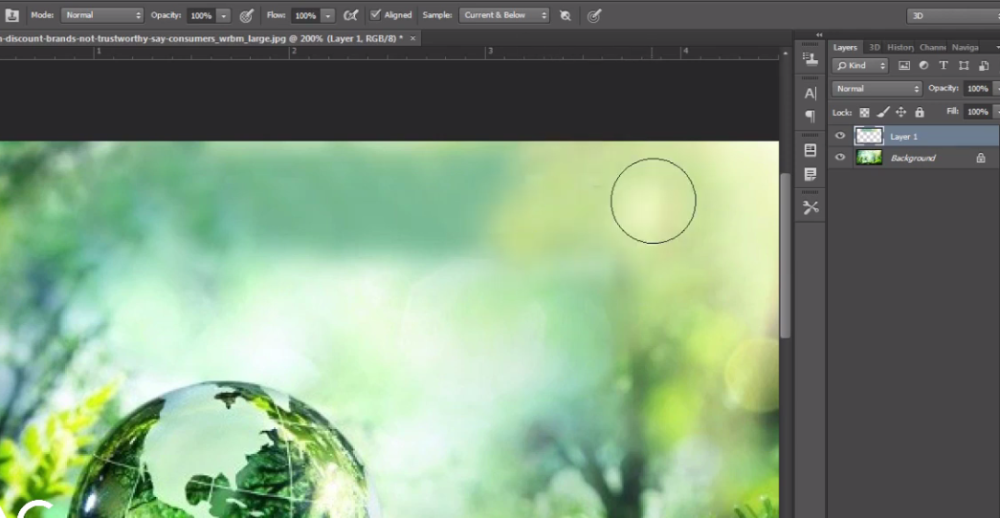