# Pen Tool, Freeform Pen Tool,

---

## Pen Tool

- untuk menyeleksi
- pen tool harus mode path
1. Klik pen tool
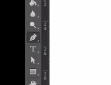
2. pilih path
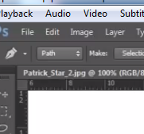
3. klik mengelilingi sesuai object
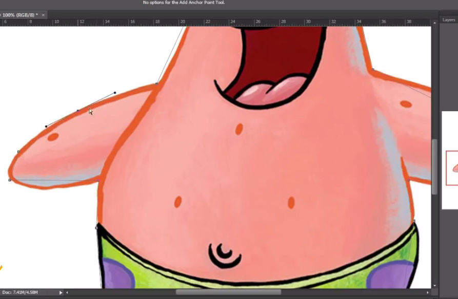

---

## kalo shape

- untuk membentuk sebuah object
1. klik pen tool
2. pilih shape
3. klik untuk mengseleksi object

---

## membuat lengkungan 

- Add Anchor Point Tool

1. Pilih Add Anchor Point

2. klik di garis seleksi
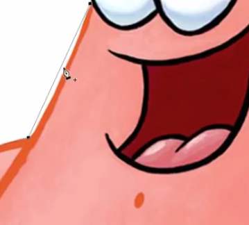
3. tarik sesuai yang diinginkan
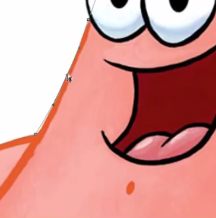

---

## Menghilangkan node

1. klik Delete Anchor Point Tool
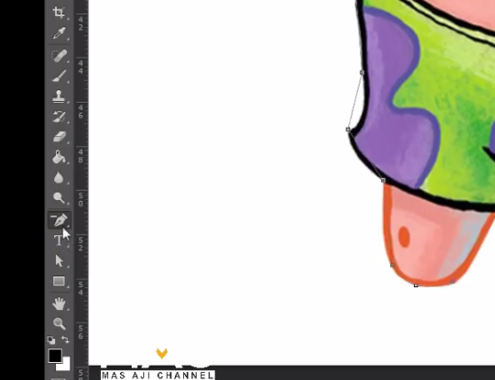
2. klik note yang ingin dihilangkan

---

## Concert Point Tool

 -untuk memunculkan node2 yang bisa kita tarik
1. Klik Convert Point Tooll
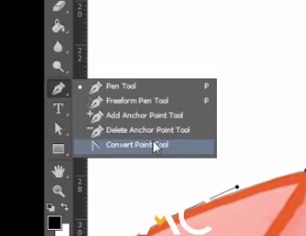
2. maka akan muncul node untuk diubah2
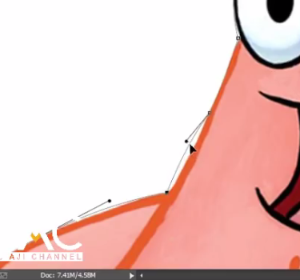

---

## Setelah Selesai Menyeleksi

1. klik kanan > make selection = untuk menyeleksi
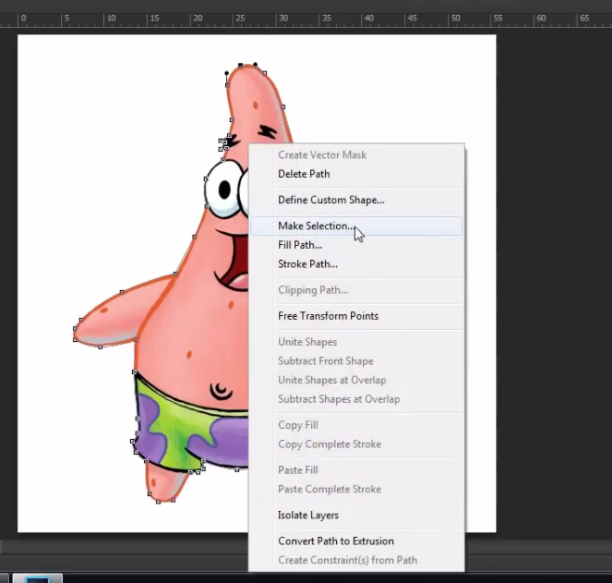
2. Feather Radius : untuk memberikan halus, semakin besar semakin halus
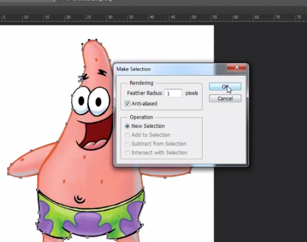
3. takan ctrl + j unutk copy object
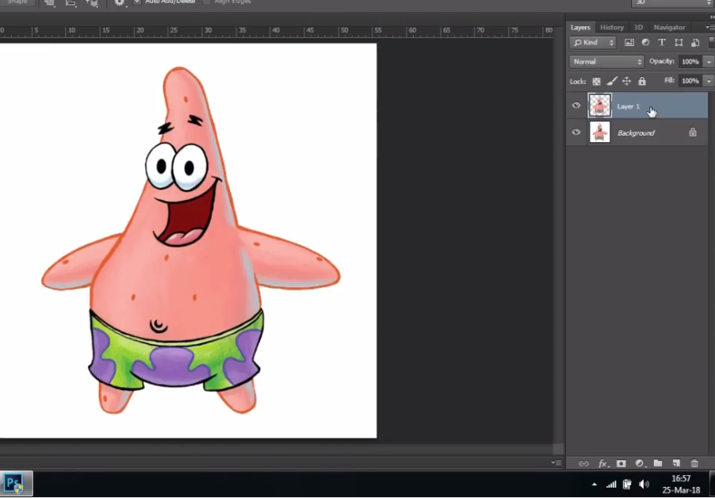

---

## Freeform Pen Tool

- seperti menulis
1. klik Freeform Pen ToolFreeform Pen Tool
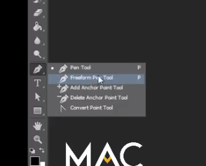
2. tekan dan geser mouse sesuai object

3. sama seperti pen tool, klik kanan > make selection > ok > copy layer
- Horizontal Type Tool = untuk membuat tulisan secara horizontal / kiri kanan
- Vertical Type Tool = untuk membuat tulisan secara vertical / atas bawah

---

## Horizontal Type Tool

- Membuat tulisan secara horizontal
1. buat document baru
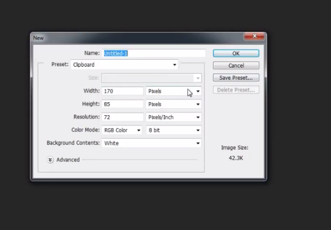
2. Klik Horizontal TYpe Tool
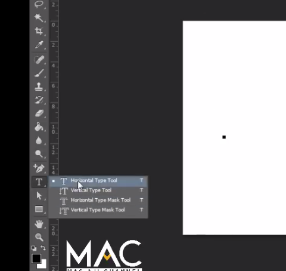
3. Ketikan 

---

## Vertical Type Tool

- Membuat tulisan secara Vertikal
1. buat document baru

2. Klik Vertical Type Tool
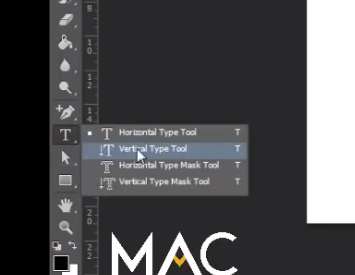
3. Ketikan 
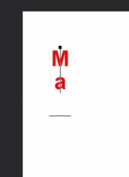

---

## Membuat efek lengkungan

1. Klik Horizontal Type Tool / Vertical Type Tool
2. ketikkan teks
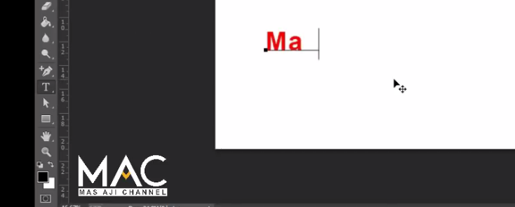
3. kita bold
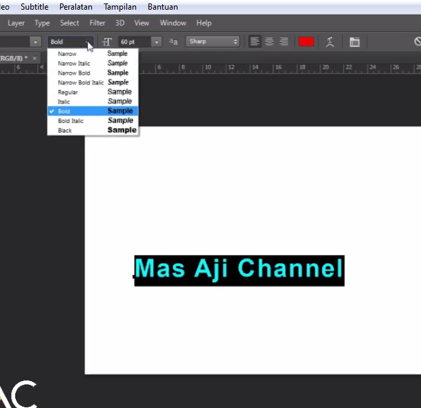
4. tekan ctrl + t
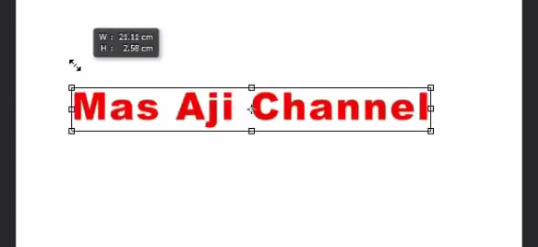
5. klik Created Warped Text
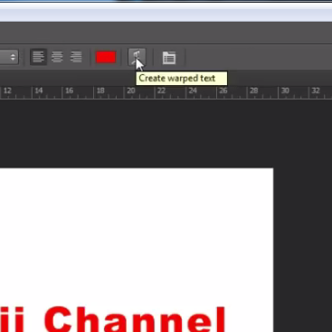
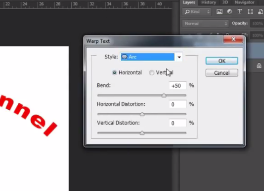

---

## Horizontal Type Mask Tool 

- untuk membuat seleksi
1. Klik Horizontal Type Mask Tools
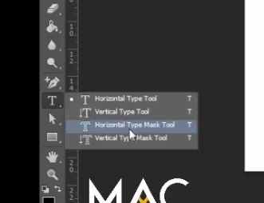
2. Ketikkan teks
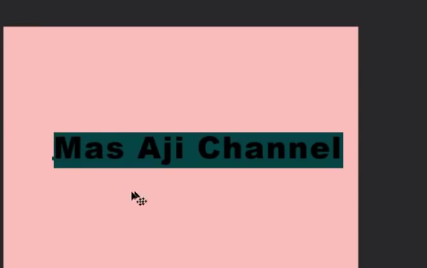
3. Klik layer 2x (akan terseleksi)
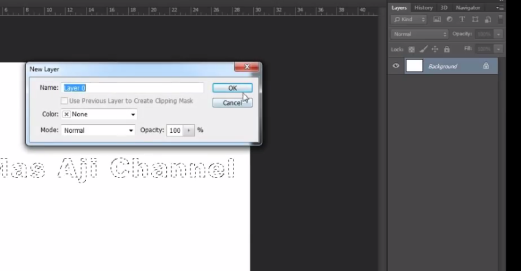
4. tekan del

5. menghilangkan seleksi = ctrl + d
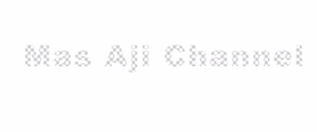
6. ambil gambar
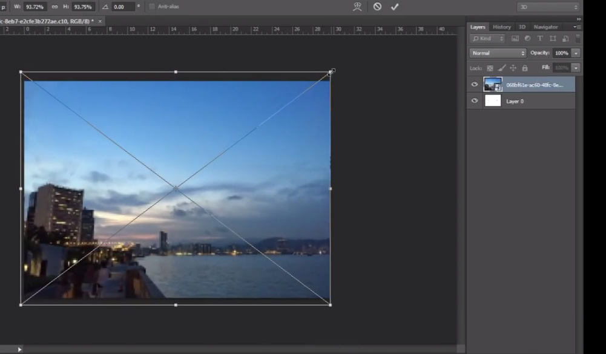
7. taruh gambar dibawah teks
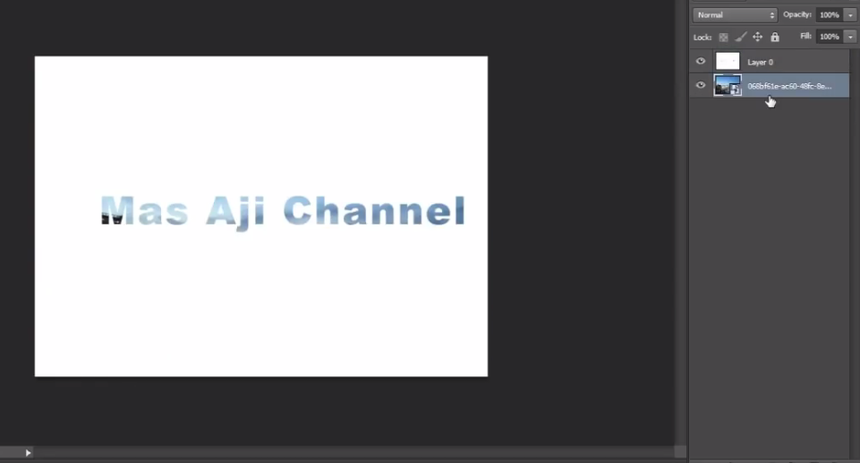
8. Drop shadow
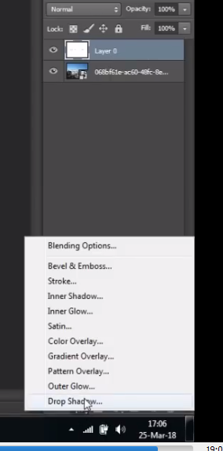
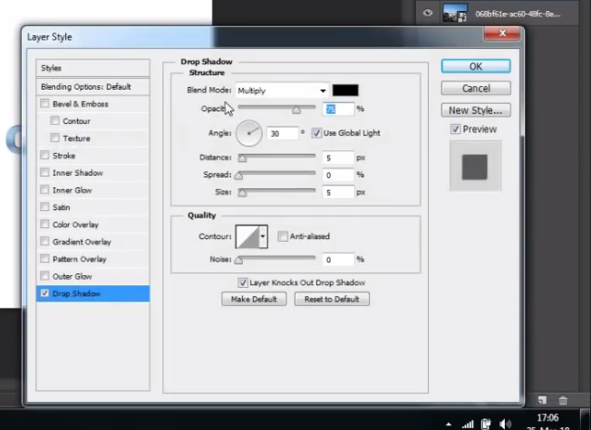
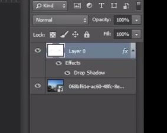