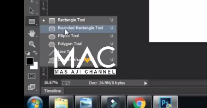
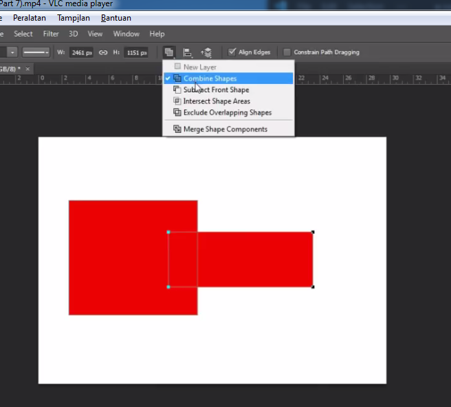
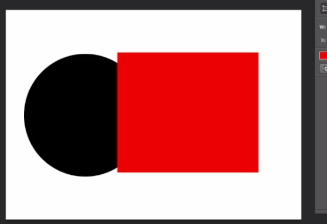
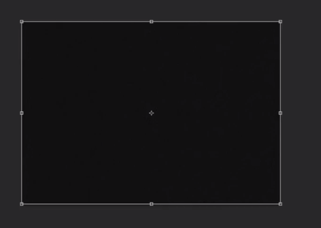

# rectangle, Rounded Ractangle, Ellipse, Polygon, Line, Custome Shape TOol, Combine, Substact, Intersect, Exclude, Marge Shape

1. Klik File > New

2. Atur ke paper > A4/ legal

3. Klik new layer

---

## Ractangle Tool

- persegi = shift, persegi panjang
- untuk biar persegi tekan shift pada keyboard

- jika tidak tekan shift

---

## Menghilangkan warna, ada hairline

1. Klik Fiil

2. klik gambar garis merah

---

## Menganti Warna Border

1. Klik stroke

2. Pilih warna

---

## Rounded Ractangle Tool

- untuk membuat object ada melengkung

1. Klik Rounded Ractangle Tool

2. otomatis muncul border-radius

---

## Ellipse Tool

- untuk membuat lingkaran

- agar menghasilkan lingkaran tekan shift

---

## Polygon Tool

1. Membuat bangun polygon

2. tarik mouse

---

## Line

- untuk membuat garis lurus

- kalo kita tekan shift maka akan lurus

---

## Custome Shape

- membuat shape yang tersedia

---

## Combine

- untuk menggabungkan shape
1. Buat shape

2. Click Combine shape

3. Buat shape

4. Click Combine

5. Hasil :

---

## Substrack

- untuk memotong shape dengan shape lain

---

## Intersect Shape

- memotong shape menghasilkan bagian yag terpotong

---

## Exclude Overlapping Shape

- Menghasilkan shape yang tidak tersentuh / tidak terpotong

---

## Marge shape

- menggabungkan shape

---

## Menggabungkan layer

1. Buat 2 buah shape

2. Klik tombol shift pada layer

3. Klik kanan > pilih Marge Shapes

4. Hasil :

---

## Memmberikan Noise

- untuk titik2

1. Filter > Noise > Add Noise...

---

## Garis bantu

1. tekan ctrl + T

2. tarik dari pinggir

3. Hasil
