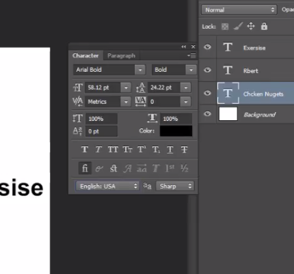

# Check Spelling, Find & Replace Text, Fill & Stroke, Content-Aware Scale, Puppet Warp

---

## Check Spelling

- untuk merapikan tulisan / membenarkan kata2 secara otomatis

1. siapkan text

2. klik layer

3. klik T icon

4. klik bentuk folder diatas

5. klik english / bahasa

6. klik edit > check spelling

7. secara otomatis akan terisi

---

## Find & Replace Text

- untuk mencari dan mengganti text yang banyak
1. Siapkan text

2. Edit > Find and Replace Text

3. Ketikan text yang ingin dicari

---

## Fill

- untuk memberi warna / texture langsung mengisi sebuah layer

1. Edit > Fill

2. Atur contents

3. Hasil :

---

## Stroke

- hairline / warna garis tepian

1. copy layer

2. Edit > Stroke

3. Atur warna dll

4. Hasil :

---

## Content-Aware Acale

- untuk mengakali biar yang stretch itu background, object tidak berpengaruh
- contoh : ingin membuat foto menutupi semua bingkai / layer

1. Buka gambar

2. Seleksi object gambar

3. simpan seleksi dalam bentuk path, select > save selection

4. Simpan object seleksi di channels

5. Hilangkan seleksi (ctrl + D), dan cek dichannels

6. gunakan content-aware scale

7. bagian protect kita cari namanya sesuai dengan yang tadi

8. Tarik background

---

## Puppet Warp

- teknik untuk membuat sebagian object menonjol
- puppet warp akan aktif jika kita sudah copy terlebih dahulu
1. kita copy layer

2. Edit > puppet warp

3. Centang show mesh untuk melihat

4. buat point

5. tarik bagian yang ingin ditonjolkan
